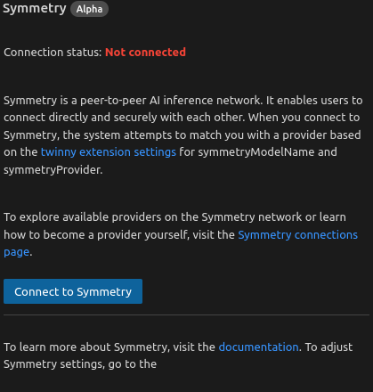

Symmetry 是一个实验性的去中心化计算网络，允许用户共享和访问计算资源。最初与 Twinny VSCode 扩展集成，Symmetry 有潜力成为开发者、研究人员和数据科学家的强大工具。

**注意**：Symmetry 仍处于 alpha 版本，可能会出现一些问题。如遇到问题，请在 [https://github.com/twinnydotdev/symmetry](https://github.com/twinnydotdev/symmetry) 上报告。


Symmetry 客户端采用 Apache 2.0 许可证。

[https://github.com/twinnydotdev/symmetry](https://github.com/twinnydotdev/symmetry)


## 在 Twinny VSCode 扩展中连接 Symmetry

如果网络中有可用的推理提供者，Symmetry 可以作为推理提供者与 Twinny VSCode 扩展配合使用。您可以在以下网址找到当前的提供者和可用模型：[https://twinny.dev/symmetry](https://twinny.dev/symmetry)。

1. 在 Twinny 扩展的设置中，选择您想要的模型。
2. 点击扩展中的“连接到 Symmetry”按钮。
3. 扩展将自动使用选定的模型连接到 Symmetry 网络。模型名称可以在 Twinny 扩展的设置中进行配置，请确保与 [https://twinny.dev/symmetry](https://twinny.dev/symmetry) 中列出的可用模型匹配。未来此过程将改进，允许用户从可用模型列表中选择。
4. 连接成功后，您将在扩展侧边栏看到绿色的“已连接”状态。
5. 尝试通过 Twinny 扩展发送一些请求，验证其是否按预期工作。

#### 未连接状态：


#### 已连接状态：


查看图标：


## 成为 Symmetry 提供者

随着 Symmetry 的发展，用户有机会通过成为提供者为网络贡献资源。以下是您需要了解的内容：

### 为什么考虑成为提供者？

- 为去中心化计算网络做出贡献
- 利用空闲计算资源
- 未来可能有奖励机制（视网络发展而定）
- 获取去中心化技术的经验
- 成为机器学习研究的数据收集者

### 如何成为提供者

1. **安装 Symmetry**：

   Unix 系统
   ```bash
   curl -fsSL https://www.twinny.dev/symmetry-unix.sh | sh
   ```

   Windows 系统
   ```bash
   iwr -useb https://www.twinny.dev/symmetry-windows.ps1 | iex
   ```

2. **配置您的节点**：
   在 `~/.config/symmetry/` 目录中创建 `provider.yaml` 文件，配置您的提供者设置。

3. **启动您的节点**：
   ```bash
   symmetry-cli
   ```

提供者将启动并执行一次测试调用：

```
ℹ️ INFO: 🔗 Initializing client using config file: /home/twinnydotdev/.config/symmetry/provider.yaml
ℹ️ INFO: 📁 Symmetry client initialized.
ℹ️ INFO: 🔑 Discovery key: xxx
ℹ️ INFO: 🔑 Server key: 4b4a9cc325d134dee6679e9407420023531fd7e96c563f6c5d00fd5549b77435
ℹ️ INFO: 🔗 Joining server, please wait.
ℹ️ INFO: 🔗 Connected to server.
ℹ️ INFO: ✅ Verification successful.
ℹ️ INFO: 👋 Saying hello to your provider...
ℹ️ INFO: 🚀 Sending test request to http://localhost:11434/v1/chat/completions
ℹ️ INFO: 📡 Got response, checking stream...
ℹ️ INFO: ✅ Test inference call successful!
```

### 程序化实现

```bash
npm install symmetry-core
```

```javascript
const config = {
  apiHostname: "localhost",
  apiKey: "apikeyforprovider", // not publically available or transported to server
  apiBasePath: "/v1",
  apiPort: 11434,
  apiProtocol: "http",
  modelName: "llama3.1:latest",
  name: "twinnydotdev",
  serverKey: "4b4a9cc325d134dee6679e9407420023531fd7e96c563f6c5d00fd5549b77435",
  systemMessage: "I'm a system message",
  userSecret: "supersecretpasswordforuptimetracking"
};

const provider = new SymmetryProvider(config);
```


### 提供者配置

`provider.yaml` 示例：

```yaml
apiHostname: localhost # 推理服务器的主机地址
apiKey: # 推理服务器的 API 密钥
apiBasePath: /v1 # 推理接口基础路径
apiPort: 11434 # 推理服务器的端口
apiProtocol: http # 推理服务器的协议
modelName: llama3:8b # 您提供的模型名称
name: provider  # 您的提供者名称
serverKey: 4b4a9cc325d134dee6679e9407420023531fd7e96c563f6c5d00fd5549b77435 # Symmetry 服务器密钥，用于处理提供者消息
systemMessage: "Im a system message" # 可选的系统消息
userSecret: "supersecretpasswordforrewardtracking" # 用于在网络上唯一标识节点的密钥
```

根据您的设置和偏好调整这些配置。

## 提供者注意事项

- 确保您的节点安全且已更新
- 注意通过您的节点传输的数据
- 保持稳定和可靠的连接

## OpenAI 兼容 API

Symmetry 现在提供了与 OpenAI 兼容的 API，允许您使用与 OpenAI 相同的 API 格式与网络交互。这使得将 Symmetry 集成到已经使用 OpenAI API 的现有应用程序变得简单。服务器运行在 `https://twinny.dev/v1`，您可以使用以下端点与其交互：

### 使用 API

Symmetry API 遵循 OpenAI API 格式，允许您使用标准的 OpenAI 客户端库或直接 HTTP 请求与网络交互。

#### 端点

- **聊天补全**：`/v1/chat/completions` - 用于与 Symmetry 网络上的模型进行基于聊天的交互

#### 请求示例

```javascript
// 使用 fetch API
const response = await fetch('https://twinny.dev/v1/chat/completions', {
  method: 'POST',
  headers: {
    'Content-Type': 'application/json',
  },
  body: JSON.stringify({
    model: 'llama3.1:latest',
    messages: [
      { role: 'system', content: '你是一个有帮助的助手。' },
      { role: 'user', content: '你好，你好吗？' }
    ]
  })
});

// 响应以服务器发送事件 (SSE) 的形式流式传输
// 您可以使用标准的 SSE 处理方法处理它
```

#### 速率限制

API 包含速率限制以确保公平使用：
- 每个时间窗口的最大请求数（由服务器配置）
- 超过限制的请求将收到 429 状态码和错误消息

#### 对话管理

API 支持通过对话 ID 进行对话管理：
- 在请求中包含 `id` 字段以维护对话上下文
- 服务器将跟踪同一对话中的消息

## 超越 VSCode：未来发展

虽然最初专注于 Twinny 扩展，但 Symmetry 的功能现在已经扩展：

- **OpenAI 兼容 API**：Symmetry 现在提供遵循 OpenAI 格式的 API，使其易于与现有应用程序集成。
- **独立使用**：Node.js 包允许开发者在任何 Node.js 应用中利用 Symmetry 网络。
- **WebSocket 统计**：通过 WebSocket 连接可获取网络的实时统计信息。

## 常见问题 (FAQ)

1. **Q: Symmetry 仅限于 VSCode 用户吗？**  
   A: 目前与 Twinny VSCode 扩展集成，但未来计划通过 Node.js 包和直接 API 访问拓展 Symmetry 的可访问性。

2. **Q: 我可以用 Symmetry 做聊天和自动补全吗？**  
   目前，Symmetry 设计用于聊天，但未来可能会用于其他用途（例如自动补全）。

3. **Q: Symmetry 如何确保数据隐私？**  
   A: Symmetry 使用加密连接进行所有通信。在初始匹配后，客户端与提供者之间直接通信，绕过中央服务器。然而，提供者可以访问解密后的数据进行处理，因此在使用网络时请考虑数据的敏感性。

4. **Q: 我可以在自己的项目中使用 Symmetry 吗？**  
   目前，Symmetry 主要用于 Twinny VSCode 扩展，但计划推出 Node.js 包，使其可以在各种项目中广泛集成。

5. **Q: 成为提供者会有奖励吗？**
- 奖励将以 SOL 区块链上的代币形式发放，这些代币将用于支付提供者的服务。
- 提供者可以通过向客户提供数据来赚取奖励。
- 将实施工作量证明（POW）算法，以确保网络的安全性和可靠性。


6. **Q: 如何获取 Symmetry 开发的最新动态？**  
   A: 请关注 Symmetry 官方 GitHub 仓库和文档，获取最新更新和公告。

通过探索 Symmetry，无论是作为用户通过 Twinny 扩展，还是作为提供者，您都在参与去中心化计算技术的发展。随着 Symmetry 的演进，它旨在为开发者和研究人员提供更灵活、强大的选择。

请参阅 [隐私政策](https://www.twinny.dev/privacy) 了解有关网络使用的信息。